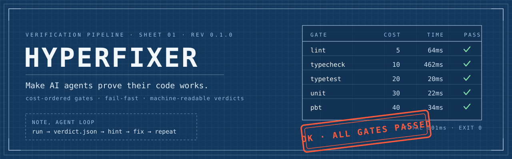

<p align="center">
  
</p>

# hyperfixer

[](https://www.npmjs.com/package/hyperfixer)
[](https://github.com/egeominotti/hyperfixer/actions/workflows/ci.yml)
[](https://egeominotti.github.io/hyperfixer/)
[](LICENSE)

📦 [npm package](https://www.npmjs.com/package/hyperfixer) · 📖 [Documentation](https://egeominotti.github.io/hyperfixer/) · 🤖 [llms.txt](https://egeominotti.github.io/hyperfixer/llms.txt) · [llms-full.txt](https://egeominotti.github.io/hyperfixer/llms-full.txt)

**Layered verification pipeline for AI-agent-written code.**

hyperfixer runs your project's quality gates in cost order, cheapest first, fail-fast, and produces a machine-readable verdict that any coding agent can consume to fix its own mistakes. Humans get a colored summary; agents get `verdict.json` and a one-line `hint` pointing at the first actionable problem.

```
✓ lint (64ms)
✓ typecheck (462ms)
✓ typetest (20ms)
✓ unit (22ms)
✓ pbt (34ms)

OK, all gates passed in 601ms
```

## Why

Agent-written code fails in layers, and each layer needs a different detector:

| Layer | Catches | Tool |
|---|---|---|
| Lint | Style drift, suspicious patterns | [Biome](https://biomejs.dev) |
| Typecheck | Type errors | `tsc --noEmit` (strict) |
| Type tests | Wrong public API types | [expect-type](https://github.com/mmkal/expect-type) + `@ts-expect-error` |
| Unit tests | Broken behavior | `bun test` |
| Property-based | Edge cases nobody thought to write | [fast-check](https://fast-check.dev) |
| Differential/parity | Two implementations disagreeing | project-defined oracle |
| Mutation | Tests that pass but assert nothing | [Stryker](https://stryker-mutator.io) |

Running everything on every change is wasteful; running only unit tests misses whole failure classes. hyperfixer orders gates by cost, stops at the first failure, and tells the agent exactly where to look, so the feedback loop is fast *and* honest.

Fast in practice: gates with equal cost run in parallel, and gates that declare `inputs` are cached by input hash, an unchanged project re-verifies in milliseconds:

```
✓ lint (0ms), cache hit
✓ typecheck (0ms), cache hit
✓ e2e (0ms), cache hit

OK, all gates passed in 2ms
```

## Requirements

- [Bun](https://bun.sh) >= 1.1

## Quick start

```bash
bun add -d hyperfixer          # from npm
bunx hyperfixer init           # detects your stack, writes hyperfixer.config.json
bunx hyperfixer doctor         # verify toolchain
bunx hyperfixer run            # run the pipeline
bunx hyperfixer install-hooks  # enforce on git commit and push
```

`init` inspects the project (Biome or ESLint, tsconfig, Bun or vitest or npm test, test directories) and generates a tailored gate list instead of a generic default.

## CLI

```
hyperfixer run [flags]      run gates in cost order, write verdict, exit 0/1
hyperfixer init             detect the stack, write hyperfixer.config.json
hyperfixer hint             print first actionable fix from last verdict
hyperfixer doctor           check toolchain and config health
hyperfixer install-hooks    install git pre-commit and pre-push hooks
hyperfixer install-claude   install Claude Code PreToolUse hook
hyperfixer claude-hook      internal, PreToolUse entry point (stdin JSON)

Run flags:
  --json                machine-readable verdict on stdout
  --quiet               no human output (verdict.json still written)
  --config <path>       config file (default hyperfixer.config.json)
  --only <a,b>          run only the named gates
  --max-cost <n>        run only gates with cost <= n
  --changed             expand {changed} in commands to git-changed files
  --no-cache            ignore and do not update the input-hash cache
  --no-fail-fast        run all gates even after a failure
  --out-dir <dir>       verdict output directory (default .hyperfixer)
```

Exit codes: `0` all gates pass, `1` a gate failed, `2` usage or config error. The contract is strict: agents can branch on the exit code alone.

## Configuration

`hyperfixer.config.json`:

```json
{
  "failFast": true,
  "outDir": ".hyperfixer",
  "gates": [
    { "name": "lint",      "cost": 5,   "command": ["bunx", "biome", "check", "."] },
    { "name": "typecheck", "cost": 10,  "command": ["bunx", "tsc", "--noEmit", "--pretty", "false"], "parser": "tsc" },
    { "name": "unit",      "cost": 30,  "command": ["bun", "test"], "parser": "bun-test" },
    { "name": "pbt",       "cost": 40,  "command": ["bun", "test", "test/property"], "parser": "bun-test" },
    { "name": "mutation",  "cost": 100, "command": ["bunx", "stryker", "run", "--incremental"], "enabled": false, "optional": true }
  ]
}
```

| Field | Meaning |
|---|---|
| `cost` | Relative cost; gates run in ascending order, `--max-cost` filters on it |
| `command` | Argv array; omit to skip the gate |
| `parser` | `tsc`, `bun-test`, or `raw`, extracts structured findings from output |
| `optional` | Skip (instead of error) when the command cannot start |
| `enabled` | `false` removes the gate from the pipeline |
| `timeoutMs` | Kill the gate after this many ms (default 600000) |
| `inputs` | Glob patterns this gate depends on; declaring them enables input-hash caching |

Gate names must be unique; duplicates are rejected at load time. A hanging gate cannot wedge an unattended agent loop: it is killed at `timeoutMs` (SIGTERM, then SIGKILL) and reported as `error`. Gates with equal `cost` run concurrently as a group; fail-fast blocks later groups only.

**Caching**: a gate that declares `inputs` stores its passing result keyed by a hash of command + file metadata (path, size, mtime). Unchanged inputs mean an instant cache hit; failures are never cached; `--no-cache` bypasses it.

**Changed-only mode**: put `{changed}` in a gate command and run with `--changed`; the token expands to the files git reports as modified, and the gate is skipped entirely when the tree is clean.

## Works with any agent

hyperfixer is agent-agnostic by construction: the interface is a CLI with strict exit codes, a JSON verdict on disk, and git hooks. Claude Code, Codex, Cursor, Kimi, Grok, or a plain shell script all consume it the same way.

**The universal loop** (put this in your agent's instructions file, `AGENTS.md` or `CLAUDE.md`):

```bash
hyperfixer run --quiet || hyperfixer hint
# => [typecheck] src/service.ts:42, Type 'string' is not assignable to type 'number'. (+3 more)
# fix, then re-run until exit 0
```

**Hard enforcement, works for every agent and every human:**

```bash
hyperfixer install-hooks
# pre-commit: gates with cost <= 50 (fast)
# pre-push:   full pipeline
```

The hooks are plain `sh`, refuse to overwrite hooks they did not write, and print the hint on failure so the blocked agent knows what to fix.

**Claude Code**, one command:

```bash
hyperfixer install-claude
```

This writes (or merges into) `.claude/settings.json` a [PreToolUse hook](https://docs.anthropic.com/en/docs/claude-code/hooks) that intercepts every `git commit` and `git push` the agent attempts, runs the pipeline, and on failure blocks the call with the hint fed back to the agent, which fixes and retries. Non-git commands are never touched.

**GitHub Actions**, three lines in anyone's CI:

```yaml
- uses: actions/checkout@v4
- uses: egeominotti/hyperfixer@main
  with:
    max-cost: "50"   # optional, config: and working-directory: also available
```

## The verdict

`hint` prints the first actionable problem with file and line; the full structured verdict is in `.hyperfixer/verdict.json`:

```jsonc
{
  "ok": false,
  "generatedAt": "2026-07-24T10:30:00.000Z",   // staleness guard
  "failedGate": "typecheck",
  "hint": "[typecheck] src/service.ts:42, Type 'string' is not assignable…",
  "durationMs": 533,
  "gates": [
    {
      "gate": "typecheck",
      "status": "fail",            // pass | fail | skip | error
      "durationMs": 458,
      "exitCode": 2,
      "findings": [
        { "file": "src/service.ts", "line": 42, "column": 5, "code": "TS2322", "message": "…" }
      ],
      "outputTail": "…"
    }
  ]
}
```

`hint` warns on stderr when the verdict is older than 10 minutes, so an agent that edited code without re-running cannot trust a stale "OK".

## Programmatic API

```ts
import { loadConfig, runPipeline } from "hyperfixer";

const verdict = await runPipeline(await loadConfig());
if (!verdict.ok) console.error(verdict.hint);
```

## Development

```bash
bun install
bun run check        # hyperfixer verifying itself (lint, typecheck, typetest, unit, pbt)
```

The repo dogfoods its own pipeline: property-based tests assert verdict invariants (`ok` if and only if no failing gate, fail-fast skips everything after the first failure), and type tests pin the public API. CI runs the pipeline on every push; a green build on `main` bumps the patch version, updates `CHANGELOG.md` and tags the release automatically.

## License

MIT
